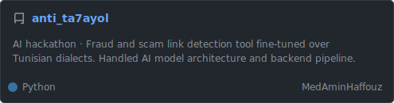
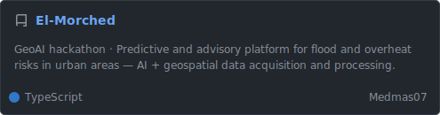
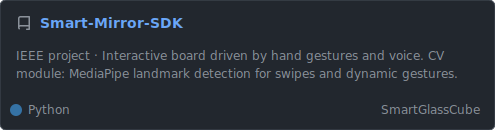

[](https://git.io/typing-svg)

```python
#!/usr/bin/python
# -*- coding: utf-8 -*-

class CSandSWEstudent:
    def __init__(self):
        self.name       = "Mohammed Amin Haffouz"
        self.role       = "Software Engineering Student · AI Research Oriented"
        self.education  = "3rd year @ INSAT"
        self.interests  = ["Deep Learning", "GPU Computing", "AI-based Research", "Systems Programming"]

    def say_hi(self):
        print("Obsessed with the why behind the how.")
        print("Teaching machines to learn, while still learning myself.")
        print("I don't use Arch btw")

me = CSandSWEstudent()
me.say_hi()
```

---

## 🔧 Stack & Tools

**Languages:**

    

**AI / ML:**

    

**Backend & Infra:**

    

---

## 🗂️ Highlight Projects

<a href="https://github.com/MedAminHaffouz/anti_ta7ayol">
  
</a>

<a href="https://github.com/Medmas07/El-Morched">
  
</a>


<a href="https://github.com/SmartGlassCube/Smart-Mirror-SDK">
  
</a>

<br>

> 💡 Some of them collaborative / hackathon projects — my contributions are detailed in each repo.

---

## 

| Project | Description | Status |
|---|---|---|
| **End of Year Project — Attention Adaptive Manager** | Cross-platform AI system that detects cognitive load, focus, and distraction sensitivity via biosignals — then acts on them through an AI agent (filtering notifications, blocking apps). Lead developer. | 🔒 Private · Ongoing |
| **dl_experiments_lab** | Personal research lab notebook. Hypothesis-driven DL experiments + Attempts to implement and replicate anything new. | 🔒 Private · Releasing Soon |

---

## 📝 Other

- 🏫 Built other websites as fullstack web dev like : [MPI Resources](https://github.com/MedAminHaffouz/MPI-Ressources-workspace) — a resource hub for incoming students at INSAT
- Long-term interest: AI as a scientific tool 🔭🧬⚛️⚡♻️🌎